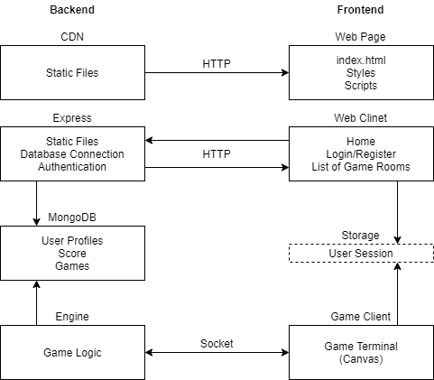

# online-chess

## Project Management
This is a team project for the JavaScript Advanced course at FMI-SU. Team members:
* Aleks Dimitrov
* Denislav Mihalev
* Viktor Kostadinov

[Trello Board](https://trello.com/b/2iTXq26E/project-js)

## Overview
Online platform for playing chess, featuring user profiles, hosting and finding matches, and live chat.

### Application Architecture



### Technologies

For the **backend**:
* Nodejs Server
* Express Framework
* MongoDB

For the **frontend**:
* page.js (routing)
* lit-html (rendering)
* Canvas API

Communication:
* SocketIO
* JSON Web Token

### Game Model

#### Board and Piece Data Structure

The board is represented by a **2-dimensional array**, where each element is a tile. The structure is indexed as follows:

* The **first dimension** is for the **rank** with **indexes 0-7** corresponding to **ranks 1-8**
* The **second dimension** is for the **file** with **indexes 0-7** corresponding to **files a-h**

The elements are of **type String** where an empty string means and unoccupied tile, and the pieces are marked with a 2-character code:

* The first character represents the color of the piece: **W** for White and **B** for Black
* The second character represents the piece type:
    * **K** - King
    * **Q** - Queen
    * **R** - Rook
    * **B** - Bishop
    * **N** - Knight
    * **P** - Pawn

***Example state:***

* **W**hite **K**ing on **e1**
* **W**hite **P**awn on **e2**
* **B**lack **K**ing on **e8**

```javascript
//   a   b   c   d    e    f   g   h
[
    ["", "", "", "", "WK", "", "", ""], // 1
    ["", "", "", "", "WP", "", "", ""], // 2
    ["", "", "", "", "",   "", "", ""], // 3
    ["", "", "", "", "",   "", "", ""], // 4
    ["", "", "", "", "",   "", "", ""], // 5
    ["", "", "", "", "",   "", "", ""], // 6
    ["", "", "", "", "",   "", "", ""], // 7
    ["", "", "", "", "BK", "", "", ""], // 8
]
```

#### Server-Client Communication

The following packet types can be send by the client:
* `auth(roomId, token)` - sent when the client first initiates a connection; unauthenticated clients cannot access any of the other packet types;
* `message(content)` - transmits a chat message;
* `action(action)` - signals the intent to move a piece on the board.

The server can send the following packet types:
* `auth(success)` - sent in response to an authentication packet from the client; will be `true` if the client is recognized as a participant for the requested room;
* `action(action)` - informs the client that a piece has been moved on the board, regardless of initiator; when the client requests to move a piece, the confirmation from the server will come via this packet;
* `state(state)` - transmits the state of the entire board; sent when the connection is initially established;
* `message(content)` - informs the client of a chat message;
* `history(history)` - transmits the entire chat history; sent when the connection is initially established.

#### Player Interaction

The client acts as a **thin terminal** where all game logic is performed on the server and the client only displays the current state and transmits player actions.

Actions are sent as a string in a format similar to standard FIDE long algebraic notation, containing the starting file and rank and ending file and rank (piece type is omitted). ***Examples:*** `a2a4` - moving from **a2** to **a4**; `c1f4` - moving from **c1** to **f4**.

#### Data Persistance

The game data structure contains information about the players, their assigned color, the chat history, the current state of the board and a history of the moves. The last part is required to validate moves that require a particular state to be performed (castling, en-passant).

The board state is **serialized** as a single string, containing 4-character-long codes of the piece color, type, file and rank. ***Examples:*** `WKe1` - **W**hite **K**ing on **e1**; `BPe7` - **B**lack **P**awn on **e7**. Empty tiles are omitted. This is also the format in which the initial game state is transmitted to the clients when they first connect.

To **deserialize** the board, the string containing the state is iterated with a step size of 4 and each piece is placed in the board data structure.